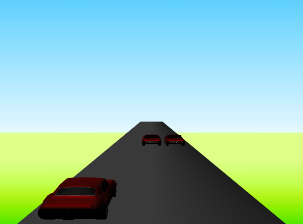

---
author:
- Xavier Santos
title: WebGL Racing Car Game
---
# WebGL Racing Car Game
A simple arcade-like racing car game running in WebGL/JavaScript for the first project in the Visual Computing course.

## Game context and rules

The game consists of the player's car evading obstacles *ad infinitum*
until it is hit.\
To start the game the player should load the model of the car from
**models/car.obj** and then press the *space key* to start playing.\
The rules are the following:

-   The player's car moves countinously forward and the player may
    alternate between three lanes.

-   There will appear obstacles from which the player must dodge by
    changing lanes.

-   The car's speed increases as the game goes by capping at a limit.

-   The score increases acoording to the distance travelled by the
    vehicle.

-   The game ends when the player's car collides with an obstacle.

The score and speed of the car are displayed in the page, as well as the
*FPS*.

## Canvas

To display the models we use a 600x448 WebGL canvas with an image
background and set the default scaling of the X coordinate to 600/448 to
keep the aspect ratio of the models in a wider display.

{#fig:game width="\\linewidth"}

## Camera

The view volume is set in prespective mode with the user at the point
(0,0,0) with a 45 degree FoV and a view distance of 30. To give a sense
of depth and to percieve the distance of the incoming obstacles.

``` {.JavaScript language="JavaScript"}
pMatrix = perspective( 45, 1, 0.05, 30 );
```

The models move between Z=-30 and Z=1. The *near* field of the
prespective matrix is set to 0.05 and the whole scene is moved -2.5 on
the Z axis.

## Game models

There are two different simple mesh models in the game. One is the road,
which has a single face composed by two triangles and scaled up on the Z
axis to generate a long rectangle in the XoZ plane. The other ones are
simple cubes. These are only placeholders and will be replaced by the
car model once the user inputs the OBJ file, which is then read by a
function adapted from the obj-reader used in class. The car model was
downloaded from [free3d.com](free3d.com) and then edited and simplified
using MeshLab[^1] to create an OBJ file with the information of the
vertex, vertex normals, vertex colors and faces of the 3D model.

{#fig:car_meshlab
width="\\linewidth"}

## Light Sources

The scene features two sources of light. A static one coming from above
and slightly behind the player's vehicle and another rotating around the
scene on the X and Y axis. As the colors are mainly given by the
vertex's uniform color, the light sources are white to preserve that
color and just add a reflection effect on the models.

``` {.JavaScript language="JavaScript"}
var lightSources = [];

    // Light source 0

    lightSources.push(new LightSource());

    lightSources[0].setPosition(-2.0,2.0,0.0,0.0);

    lightSources[0].setIntensity(1.0,1.0,1.0);

    lightSources[0].setAmbIntensity(0.2,0.2,0.2);

    lightSources[0].switchRotYYOn();

    lightSources[0].switchRotXXOn();

    lightSources[0].setRotationSpeed(1.0);

    // Light source 1

    lightSources.push(new LightSource());

    lightSources[1].setPosition(0.0,10.0,1.0,0.0);

    lightSources[1].setIntensity(0.8,0.8,0.8);

    lightSources[1].setAmbIntensity(0.5,0.5,0.5);
```

## Colors

To obtain the colors of the models, first we obtain the color resulting
from the ilumination according to Phong's model and then we multiply it
with the vertex color, which is given directly to the model, either by
the OBJ file or directly to the vertices in the sceneModels constructor.

``` {.JavaScript language="JavaScript"}
//shader-vs
    fColor += diffuse + specular;   
    vertexColor = vec4(aVertexColor, 1.0);

    //shader-fs 
    void main(void) {
        gl_FragColor = fColor * vertexColor;
    }
```

## Animation

Game logic and animation are mainly implemented in the
**gamefunctions.js** file. The **gameStart()** function is triggered by
pressing the *space key*, this function sets the position of the
obstacles to Z=-30, the intitial speed of the game is set/reset as well
as the score.\
When the game is runnig it is controlled by the **obstaclesMove(speed)**
function. There is applied a translaction to the objects positively
across the Z axis according to the current speed of the game. If the
obstacles are in the same Z position as the player, there will be a
check for a collision. In the case there is a collision the game will
stop an the player's vehicle will start rotating around the Y axis.
Having no collisions, the obstacles will reach the end of the view space
and respawn in a random lane back at Z=-30 and the game speed will
increase if the speed limit has not yet been reached.

``` {.JavaScript language="JavaScript"}
function obstaclesMove ( speed ) {
        obstacle1.tz = obstacle2.tz += speed

        if (obstacle1.tz >= 0 || obstacle2.tz >= 0) {
            checkColision();
        }

        if (obstacle1.tz >= 1 || obstacle2.tz >= 1){
            resetObstacles();
            if(gameSpeed < 0.50){
                gameSpeed += 0.01;
                carSpeed = Math.floor(gameSpeed * 1000 - 100);
                document.getElementById('car_speed').innerHTML = 'SPEED: ' + carSpeed + ' KPH';
                score += gameSpeed * 1000;
                document.getElementById('score').innerHTML = 'SCORE: ' + score;
            }
        }
    }
```

## Conclusion

The game is fully functional and running without noticeable bugs in
vanilla JavaScript and WebGL using the code provided by the professor in
the practical classes. The view angle selection was not implemented as
it was not a relevant feature for the gameplay.\
There was an effort to include textures in the road but as this feature
was not totally implemented it was left out of the final release.
Although, some residual code for the texture implementation was left
commented in the shaders and the main JavaScript code.

[^1]: [www.meshlab.net](www.meshlab.net)
